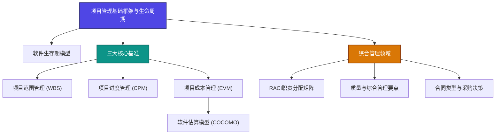

# 🗺️ LLM Wiki 知识地图 (MOC)

欢迎来到知识地图 (Map of Content)。这里是整个 Wiki 的网状连接图景，通过核心线索将零散的知识关联起来。

---

## 🧠 学习与认知方法 (Methodology)
认知方法论是构建所有专业知识的底层操作系统。
*   [[wiki/02_方法论/第一性原理|第一性原理]] ── 剥离表象，回归事物最本质的物理定律与公理进行推导。
*   [[wiki/02_方法论/费曼学习法|费曼学习法]] ── 通过向他人（甚至是非专业人士）用最简单的语言解释，来检验并深化自己的理解。

---

## 🛠️ 软件项目管理 (Project Management)
围绕软件工程与项目管理的十大知识领域及五大过程组，构筑工程落地的体系化基石。

### 1. 基础与生命周期
*   [[wiki/01_项目管理/项目管理基础框架与生命周期|项目管理基础框架与生命周期]] ── 过程组与知识领域（房屋模型）、干系人与项目章程。
*   [[wiki/01_项目管理/软件生存期模型|软件生存期模型]] ── 瀑布、原型、增量、螺旋及敏捷 Scrum 模型的对比与抉择。

### 2. 项目核心基准（范围、进度、成本）
*   [[wiki/01_项目管理/项目范围管理|项目范围管理]] ── 范围基准、WBS 工作分解结构、产品与工作范围核实。
*   [[wiki/01_项目管理/项目进度管理|项目进度管理]] ── 活动排序、依赖关系、三点估算及关键路径法 (CPM)。
*   [[wiki/01_项目管理/项目成本管理|项目成本管理]] ── 代码行估算、挣值管理 (EVM) 公式及计算实例。
*   [[wiki/01_项目管理/软件估算模型|软件估算模型]] ── 软件规模与工作量估算分类，COCOMO 估算级别。

### 3. 组织、质量与采购管理
*   [[wiki/01_项目管理/质量与综合管理要点|质量与综合管理要点]] ── 激励理论、组织结构、积极与消极风险应对、变更控制流。
*   [[wiki/01_项目管理/RACI职责分配矩阵|RACI职责分配矩阵]] ── 团队分工与职责分配（负责R、最终负责A、咨询C、知情I）。
*   [[wiki/01_项目管理/合同类型与采购决策|合同类型与采购决策]] ── 总价合同、成本补偿合同、工料合同（T&M）的风险特征与采购决策。

---

## ⚙️ 系统管理
*   [[schema|LLM Wiki 运行规范]] ── 知识库架构设计、命名规范与 AI 操作流。
*   [[log|Wiki 更新日志]] ── chronological（时间线）审计日志。
*   [[index|全局索引 (Index)]] ── Wiki 全局符号表。

---
*返回：[[index|全局索引]]*
