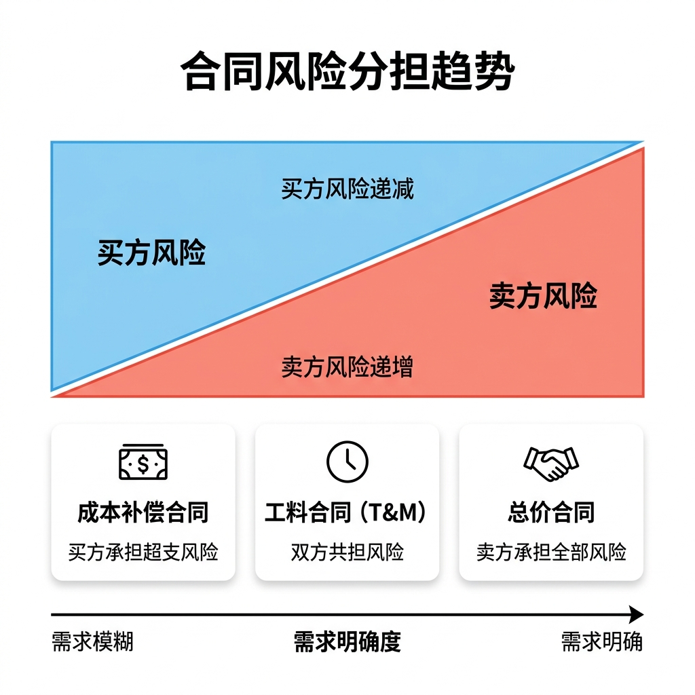

# 合同类型与采购决策

在进行采购决策时（如软件外包、购买第三方组件），选择适当的合同类型能够有效管理项目风险。**不同合同类型下买卖双方的风险分担，是项目采购管理中最高频的选择题考点。**

---

## 📊 买方与卖方的风险分担趋势图

当采购需求从“极不明确”向“完全明确”过渡时，适用的合同类型及风险转移规律如下：

---

## 🤝 三大主流合同类型对比

### 1. 总价合同 (Fixed-Price Contracts)
*   **定义**：为交付的产品、服务或成果设定一个固定的总价格。
*   **风险承担**：**卖方（乙方）承担最大风险**。如果实际开发成本超出合同总价，超出部分由卖方自行承担。**买方（甲方）风险最小**。
*   **适用场景**：**范围与需求非常明确、稳定，且后续几乎不会发生变更的项目**。
*   **细分类别**：
    *   **固定总价合同 (FFP, Firm Fixed Price)**：价格完全固定，除非工作范围变更，否则不能调整。
    *   **总价加激励费用合同 (FPIF, Fixed Price Incentive Fee)**：设定总价上限，并提供与绩效（如提前完工）挂钩的财务激励。

### 2. 成本补偿合同 (Cost-Reimbursable Contracts)
*   **定义**：买方负责向卖方报销开发过程中产生的全部**实际成本**，并额外支付一笔金额作为卖方的利润（通常为固定数额或百分比）。
*   **风险承担**：**买方（甲方）承担最大风险**（需要为可能发生的成本超支买单）。**卖方（乙方）风险最小**（哪怕超支，其成本也能获得全额报销）。
*   **适用场景**：**项目研发性质强、技术风险极高、需求在前期极其模糊，或急需快速启动的项目**。
*   **细分类别**：
    *   **成本加固定费用 (CPFF, Cost Plus Fixed Fee)**：买方报销成本，并支付一笔固定金额的利润（不随实际成本变动）。
    *   **成本加激励费用 (CPIF, Cost Plus Incentive Fee)**：买方报销成本，若实际成本低于目标成本，买卖双方按比例（如 80/20）共享节约的金额。
    *   **成本加按比例收费 (CPPC, Cost Plus Percentage of Cost)**：利润直接按成本的百分比提取。**★ 注意 ★**：此类合同会诱导乙方故意拖延、做大成本以赚取更多利润，在很多正规工程招标中是**被法律所明文禁止**的。

### 3. 工料合同 (T&M, Time and Material Contracts)
*   **定义**：单价固定（如 1000 元/人天），但总工时未定，最终费用等于单价乘以实际消耗的时间和材料量。
*   **特点**：属于总价合同与成本补偿合同的混合体。为了防止成本无限蔓延，买方通常会在合同中设定**“最高限额 (Not-to-Exceed Limit)”**。
*   **适用场景**：**项目紧急、开发规模较小、短期内需要快速补充人手，或工作内容过于简单无法确定总价时**。

---

## 🔗 关联引用
*   返回：[[index|全局索引]] | [[wiki/01_项目管理/质量与综合管理要点|质量与综合管理要点]]
