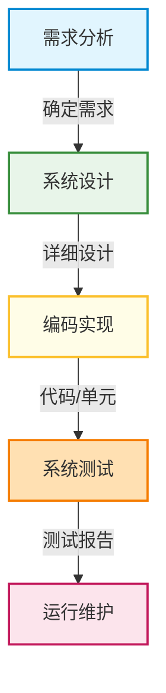
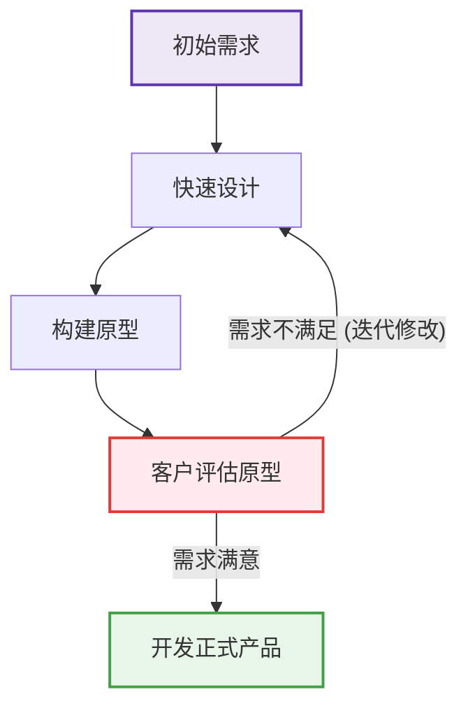
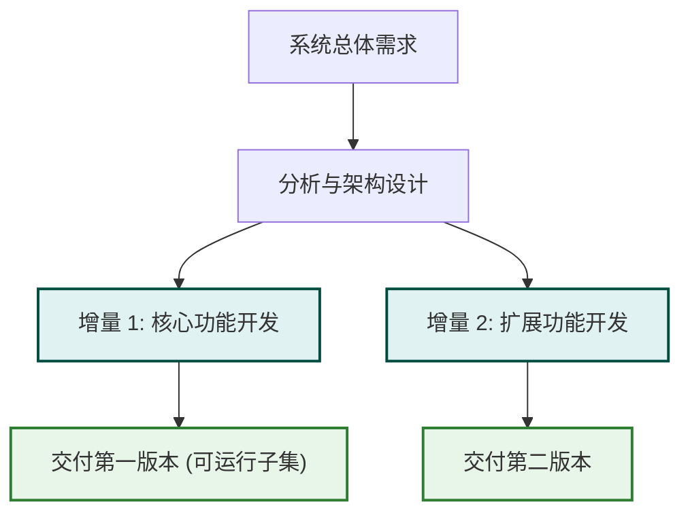
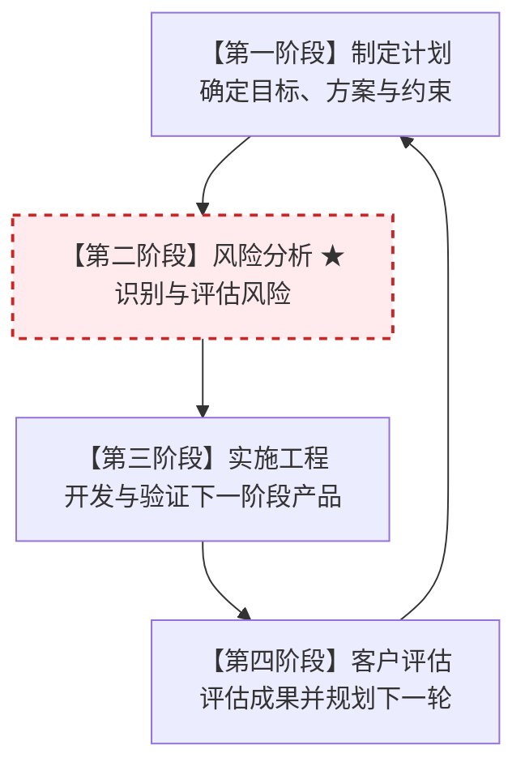
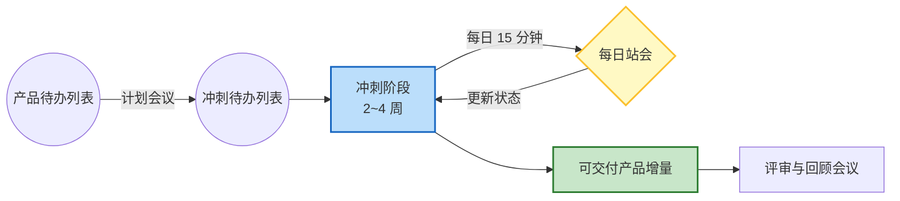

# 软件生存期模型 (Development Life Cycle Models)

**软件生存期模型**（又称开发模型）是软件开发过程的框架，描述了从项目启动、开发、测试到维护的各个活动阶段如何组织和推进。**这是软件项目管理中极易考查的经典简答与选择题考点。**

---

## 🏛️ 经典传统生存期模型

### 1. 瀑布模型 (Waterfall Model)
*   **特点**：**线性顺序**，阶段间存在严格的瀑布式流向。前一个阶段完成并输出文档后，下一个阶段才能开始。
*   **优缺点**：结构严谨，文档齐全，容易管理；但**不适应变更**，风险推迟到项目后期（测试阶段）才暴露。
*   **适用场景**：**需求非常明确且稳定的项目**（如银行核心重构、国防软件）。

### 2. 原型模型 (Prototyping Model)
*   **特点**：快速构建一个可视化的软件原型展示给用户，以明确和修正用户需求。
*   **适用场景**：**需求极其模糊、不确定或用户表达不清的项目**。

### 3. 增量/渐进模型 (Incremental Model)
*   **特点**：将软件产品分解为多个增量构件分别开发。每次迭代都交付一个**可运行的系统子集**。
*   **优势**：能较早让用户看到部分可用产品，降低整体失败风险。

### 4. 螺旋模型 (Spiral Model)
*   **★ 核心考点 ★**：**引入了“风险分析”**。它将瀑布模型和原型模型结合起来，沿着螺线多次迭代，每次迭代包含：制定计划 $\rightarrow$ 风险分析 $\rightarrow$ 实施工程 $\rightarrow$ 客户评估。
*   **适用场景**：**大型、复杂、高风险的软件项目**。

---

## ⚡ 敏捷开发模型 (敏捷 - Scrum)

敏捷开发是一种以人为核心、迭代、循序渐进的软件开发方法，特别强调积极适应需求变化。其中 **Scrum** 是最流行的框架。

### 1. Scrum 三大角色
*   **产品负责人 (PO)**：确定产品方向，维护产品待办列表，代表业务与用户价值。
*   **敏捷教练 (SM)**：帮助团队移除障碍的仆从式领导，维护 Scrum 规则的贯彻执行。
*   **开发团队**：跨职能的自我管理团队，负责在每个冲刺内交付可工作的软件增量。

### 2. 核心运作机制
*   **冲刺 (Sprint)**：一个固定的时间盒（通常为 2~4 周），在此期间团队要交付潜在可用的软件增量。
*   **每日站会**：每天 15 分钟，沟通昨日进展、今日计划以及遇到的障碍。
*   **评审会与回顾会**：冲刺结束时展示产品（评审）并总结改进流程（回顾）。

---

## 🔗 关联引用
*   返回：[[index|全局索引]] | [[wiki/01_项目管理/项目管理基础框架与生命周期|基础框架与生命周期]] | [[wiki/00_系统索引/知识地图|知识地图]]
