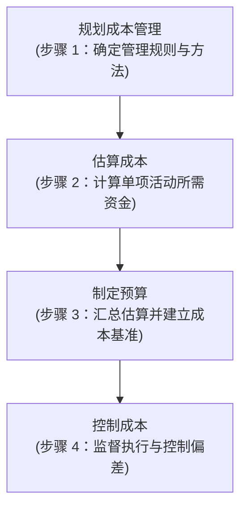
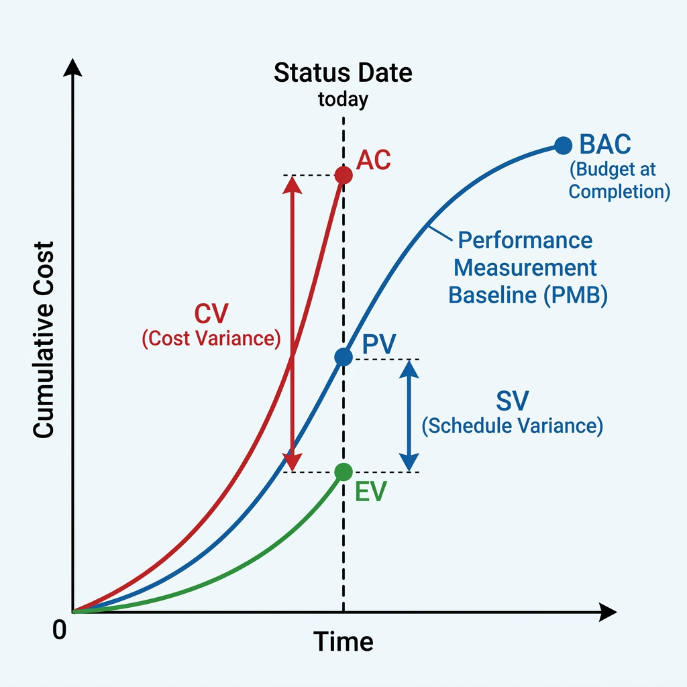
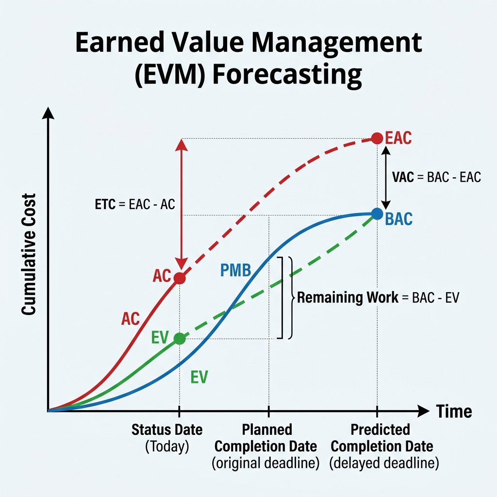

# 项目成本管理

项目成本管理确保项目在批准的预算内完成。本章的**挣值管理 (EVM) 是必考的计算题大户。**

---

## 🔄 软件项目成本管理的过程

项目成本管理是一个具有严格逻辑先后顺序的闭盘过程，主要包含以下 **4 个按顺序进行的步骤**：



### 1️⃣ 规划成本管理 (Plan Cost Management)
*   **内容**：确定如何估算、预算、管理、监督和控制项目成本。
*   **输出**：**成本管理计划**（确定估算精度等级、计量单位如人月/人天、控制临界值、绩效测量规则等）。
*   **软件项目特色**：需根据开发生命周期定位。敏捷项目（如 Scrum）通常**固定时间和成本**（固定团队规模和迭代周期），通过**动态调整范围**（待办列表优先级）来控制成本。

### 2️⃣ 估算成本 (Estimate Costs)
*   **内容**：对完成项目活动所需资金进行近似估算。
*   **方法**：类比估算、参数估算、自下而上估算、三点估算等。
*   **软件项目特色**：通常使用**功能点法 (FPA)**、**COCOMO II 模型**或**代码行法 (LOC)** 来评估软件规模。由于技术和需求的不确定性，常结合三点估算法以降低估算偏差。

### 3️⃣ 制定预算 (Determine Budget)
*   **内容**：汇总所有单个活动或工作包的估算成本，建立一个经批准的**成本基准 (Cost Baseline)**。
*   **预算构成**：
    $$\text{项目预算} = \text{成本基准} + \text{管理储备}$$
    $$\text{成本基准} = \text{活动估算} + \text{应急储备}$$
    
    ```mermaid
    graph TD
        A["项目预算 Project Budget"] --> B["成本基准 Cost Baseline"]
        A --> C["管理储备 Management Reserve (针对未知的未知)"]
        B --> D["控制账户/工作包估算"]
        B --> E["应急储备 Contingency Reserve (针对已知的未知)"]
    ```
*   **软件项目特色**：主要预算分配在人力资源（研发、测试、PM、设计等人员的月薪/时薪费率）以及非人力资源（如云服务器订阅费、软件授权许可等）上。

### 4️⃣ 控制成本 (Control Costs)
*   **内容**：监督项目状态以更新项目成本，并管理成本基准变更。
*   **工具**：**挣值管理 (EVM)** 计算 $PV$、$AC$、$EV$，并通过偏差（$CV$、$SV$）和绩效指数（$CPI$、$SPI$）分析项目状况。
*   **软件项目特色**：重点在于防止**范围蔓延 (Scope Creep)**。在敏捷开发中，通常利用**燃尽图 (Burn-down Chart)** 或团队迭代速率 (Velocity) 实时反映故事点与资金消耗情况。

---

## 💻 软件项目成本的特点

*   **知识密集型**：人工成本占比极高，软件开发主要依赖研发人员的智力投入。
*   **直接成本低，间接成本高**：除人员工资外，软件开发所需的办公场地折旧、管理支持等间接费用占比大，需注意合理区分两类成本的构成。

---

## 📐 成本估算方法

*   **类比估算 (Analogous Estimating)**：以过去类似项目的实际成本为依据来估算。速度快但准确度较低，适合项目前期。
*   **自下而上估算 (Bottom-up Estimating)**：对单个工作包或活动进行估算，然后向上汇总。准确度高但耗时耗力。
*   **参数估算 (Parametric Estimating)**：利用历史数据与其它变量（如代码行数、功能点）之间的统计关系来估算。
*   **代码行估算 (LOC, Line of Code)**：**软件项目特有方法**。根据预估的代码行数，乘以历史生产率（如每行代码多少钱或每人天写多少行），从而计算工作量和综合成本。

---

## 📈 成本控制：挣值管理 (EVM)

**★ 必考计算题核心 ★**

挣值管理（Earned Value Management）通过引入“挣值”这一概念，将范围、进度和资源结合起来评估项目绩效。

### 1. 核心数值与基准概念 (EVM 状态图)

挣值管理的基础由 **3 个核心数值**、**2 个基准概念**以及测量它们关系的 **EVM 状态曲线图** 组成：



#### 🔵 计划基准体系
*   **PMB (绩效测量基准, Performance Measurement Baseline)**：图中**蓝色的 $S$ 累计曲线**。它集成了项目范围、进度和成本，是衡量项目执行绩效的整体计划累计参考线。
*   **BAC (完工预算, Budget at Completion)**：蓝色 PMB 曲线**最末端的终点圆点**。代表整个项目所有计划工作的预算总额。在执行期间通常保持不变。
*   **PV (计划价值, Planned Value)**：在检查点（Status Date，图中虚线）时，PMB 曲线对应的具体计划预算值（**蓝色交点**）。

#### 🔴 实际开销体系
*   **AC (实际成本, Actual Cost)**：图中**红色的实际成本累计曲线**。其在检查点对应的交点（**红色交点**）代表到目前为止实际花掉的钱。

#### 🟢 实际挣值体系
*   **EV (挣值, Earned Value)**：图中**绿色的实际价值累计曲线**。其在检查点对应的交点（**绿色交点**）代表到目前为止实际做完的工作值多少预算。

---

### 2. 偏差分析与绩效指标 (Status Date 评估)

在检查点（Status Date），通过将 PV、AC 和 EV 进行对比，计算出项目的偏差与绩效指数：

| 指标 | 公式 | 判断标准 | 图示几何含义 |
| :--- | :--- | :--- | :--- |
| **成本偏差 (CV)** | $CV = EV - AC$ | $CV > 0$ 节约；$CV < 0$ 超支 | 图中**左侧红色双头箭头**所跨越的垂直高度差（AC 与 EV 之间） |
| **进度偏差 (SV)** | $SV = EV - PV$ | $SV > 0$ 超前；$SV < 0$ 落后 | 图中**右侧蓝色双头箭头**所跨越的垂直高度差（PV 与 EV 之间） |
| **成本绩效指数 (CPI)** | $CPI = \frac{EV}{AC}$ | $CPI > 1$ 节约；$CPI < 1$ 效率低 | 每花 $1$ 元钱创造了多少预算价值 |
| **进度绩效指数 (SPI)** | $SPI = \frac{EV}{PV}$ | $SPI > 1$ 超前；$SPI < 1$ 速度慢 | 实际进度是计划进度的多少倍 |

---

### 3. 完工预测与计算公式 (Forecasting 趋势图)

随着项目的进展，团队需要根据当前累计绩效，对完工时的成本和状态趋势进行预测：



| 预测指标 | 常用公式 (按典型偏差) | 在趋势图中的几何与管理含义 |
| :--- | :--- | :--- |
| **完工估算 (EAC)** | **典型**：$EAC = \frac{BAC}{CPI}$<br>**非典型**：$EAC = AC + BAC - EV$ | **红色预测虚线最右端的终点高度**。代表预测项目最终完工时，一共要花多少钱。 |
| **完工尚需估算 (ETC)** | **典型**：$ETC = \frac{BAC - EV}{CPI}$<br>**非典型**：$ETC = BAC - EV$ | **图中红色垂直双头箭头的高度**。代表从今天（Status Date）开始到项目最终完工 EAC 之间，还需要额外支出的金额（$ETC = EAC - AC$）。 |
| **完工偏差 (VAC)** | $VAC = BAC - EAC$ | **图中最右侧黑色双向垂直箭头的高度**。代表总预算 BAC 平台高度与完工估算 EAC 高度之间的垂直差额。若 $EAC > BAC$（即 $VAC < 0$），表示最终会超支。 |
| **剩余工作价值 (Remaining Work)** | $\text{Remaining Work} = BAC - EV$ | **图中最右侧绿色垂直大括号的高度**。指从今天的实际挣值高度（EV）到最终完工高度（BAC）之间，还剩多少工作价值需要完成。 |
| **完工尚需绩效指数 (TCPI)** | **基于 BAC 目标**：<br>$TCPI = \frac{BAC - EV}{BAC - AC}$ | 为了实现特定管理目标，未来的剩余工作在利用剩余资金时，必须达到的成本效率（$\frac{\text{Remaining Work}}{\text{剩余资金}}$）。 |

#### 🔍 典型与非典型偏差深度解析

在预测未来项目开销时，EAC 和 ETC 会根据**“过去发生的偏差（无论是好是坏）在未来是否会继续发生”**分为两种预测场景：

##### 1. 典型偏差 (Typical Deviation)
*   **核心假设**：过去发生的偏差在未来**仍将持续**。前期的成本表现（当前的 $CPI$）代表了未来的真实趋势。
*   **计算逻辑**：未来的剩余工作必须按照当前的成本效率（$CPI$）来进行折算。
    *   **ETC 典型** = $\frac{\text{剩余工作}}{CPI} = \frac{BAC - EV}{CPI}$
    *   **EAC 典型** = $AC + ETC_{典型} = \frac{BAC}{CPI}$
*   **应用场景**：
    *   **技术瓶颈**：新团队因不熟悉新技术栈导致开发缓慢，此问题短期内无法改变。
    *   **环境/市场因素**：原材料或人工成本发生持续性上涨，未来的采购价依旧居高不下。

##### 2. 非典型偏差 (Atypical Deviation)
*   **核心假设**：过去发生的偏差只是**偶然/一次性事件，未来不会再发生**。未来的剩余工作将完全按原计划预算（即未来 $CPI = 1$）来执行。
*   **计算逻辑**：剩余工作值多少预算，就花多少钱，不做折算。
    *   **ETC 非典型** = $\text{剩余工作} = BAC - EV$
    *   **EAC 非典型** = $AC + ETC_{非典型} = AC + BAC - EV$
*   **应用场景**：
    *   **偶发事故**：由于前期的暴雨、设备突发故障、关键人员请假等意外引发了一次性超支或延误，现已恢复正常。
    *   **单次超支**：项目前期进行了一次性的采购垫资，此后不会再有同类大额额外支出。

---

## 🧱 经典“围墙案例”计算演练

> **【题干背景】**
> 计划修建一条 $100$ 米长的围墙，每米预算为 $100$ 元，总预算为 $10,000$ 元。计划每天修建 $10$ 米，共计 $10$ 天完工。
> **在第 4 天结束时**，项目经理去现场检查，发现：
> 1. 实际上只修好了 $30$ 米围墙。
> 2. 财务账单显示，实际已经花掉了 $4,000$ 元。
>
> **【求解 PV, EV, AC 并计算绩效】**

### 求解过程：
1.  **PV (计划价值)**：按照计划，前 4 天应该修完 $40$ 米，其预算价值为：
    $$PV = 40 \text{ 米} \times 100 \text{ 元/米} = 4,000 \text{ 元}$$
2.  **AC (实际成本)**：实际花掉了多少就是多少：
    $$AC = 4,000 \text{ 元}$$
3.  **EV (挣值)**：实际修好了 $30$ 米，按照原计划每米 $100$ 元计算，其“挣”得的价值为：
    $$EV = 30 \text{ 米} \times 100 \text{ 元/米} = 3,000 \text{ 元}$$

### 绩效评估：
*   **成本偏差 (CV)**：
    $$CV = EV - AC = 3,000 - 4,000 = -1,000 \text{ 元} \quad (< 0，\text{资金超支})$$
*   **进度偏差 (SV)**：
    $$SV = EV - PV = 3,000 - 4,000 = -1,000 \text{ 元} \quad (< 0，\text{进度落后})$$
*   **成本绩效指数 (CPI)**：
    $$CPI = \frac{EV}{AC} = \frac{3,000}{4,000} = 0.75 \quad (< 1，\text{效率低下})$$
*   **进度绩效指数 (SPI)**：
    $$SPI = \frac{EV}{PV} = \frac{3,000}{4,000} = 0.75 \quad (< 1，\text{速度滞后})$$

> **【结论】** 项目处于**成本超支 1000 元且进度落后 10%** 的糟糕状态。

---

## 🔗 关联引用
*   返回：[[index|全局索引]] | [[wiki/01_项目管理/项目管理基础框架与生命周期|基础框架]] | [[wiki/01_项目管理/项目进度管理|项目进度管理]] | [[wiki/00_系统索引/知识地图|知识地图]]
